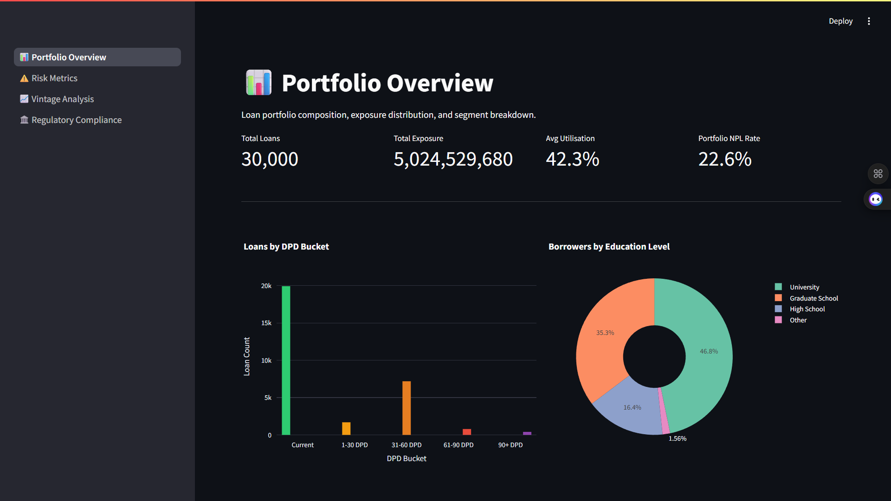
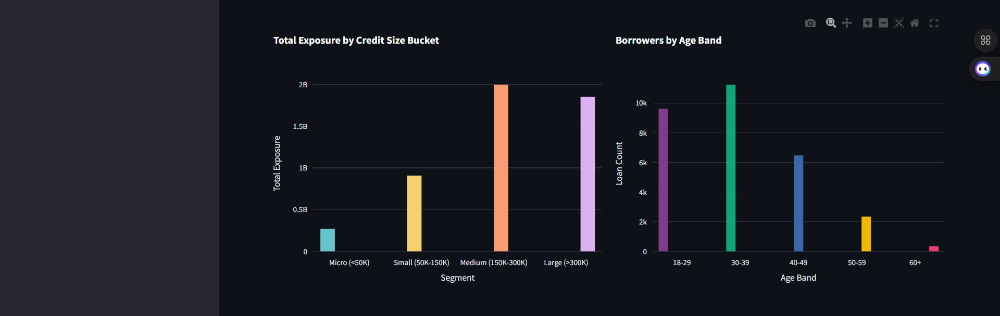
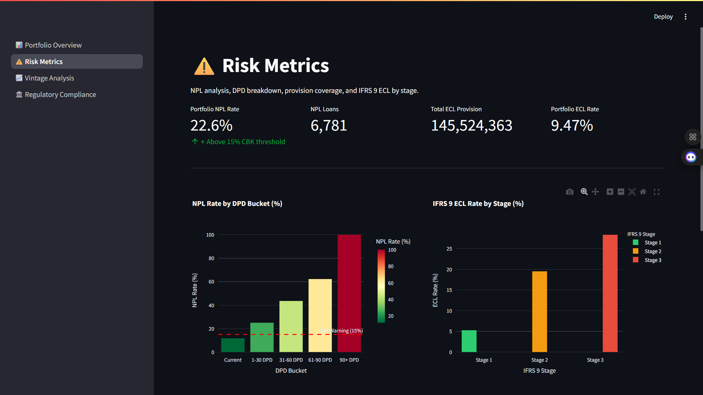
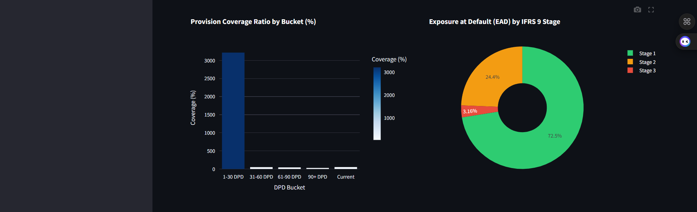
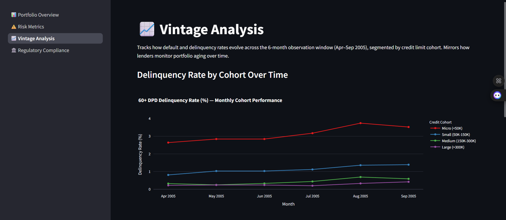
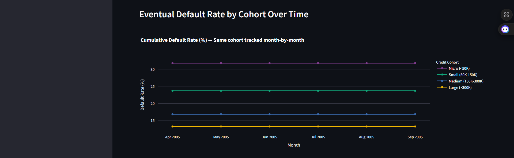
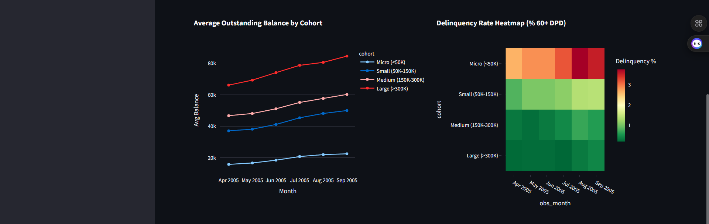
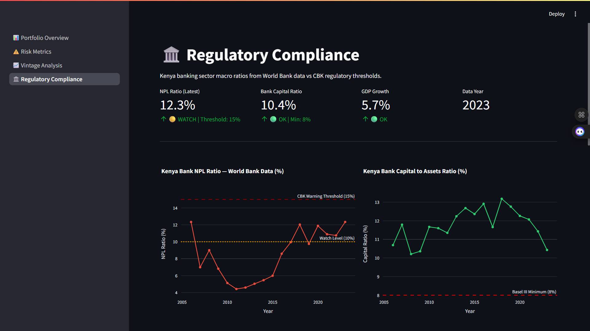
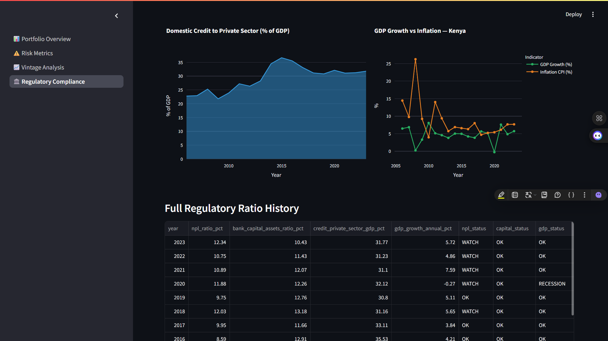
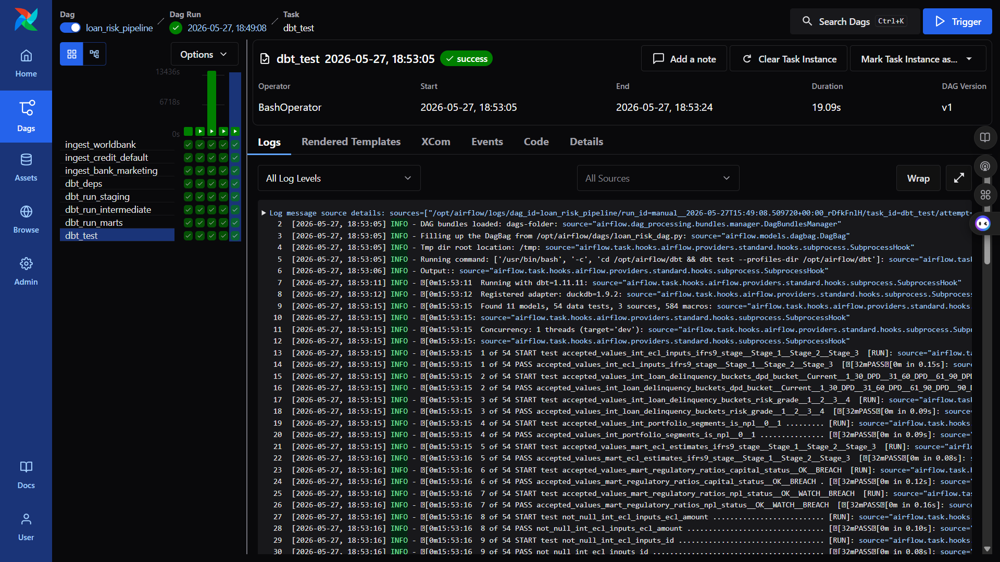

# 🏦 LoanRisk Analytics: Enterprise Credit Risk Intelligence Pipeline

**LoanRisk Analytics** is a production-grade credit risk intelligence pipeline that ingests 30,000 real credit card client records from the UCI Machine Learning Repository and 41,188 real bank customer records from a Portuguese telemarketing campaign, fetches 5 Kenya banking sector macro indicators from the World Bank Open Data API spanning 25 years via wbgapi, classifies every loan into DPD delinquency buckets (Current → 90+ DPD) using worst-case payment status logic across a 6-month observation window, computes IFRS 9 Expected Credit Loss staging across three risk categories (Stage 1/2/3) with empirical PD estimates derived directly from the portfolio, builds monthly vintage curves tracking how default and delinquency rates evolve across credit size cohorts, benchmarks the portfolio against Central Bank of Kenya regulatory thresholds and Basel III minimum capital requirements, and surfaces all of this across a 4-page Streamlit dashboard — the complete analytical stack a credit risk analyst at a commercial bank would use to monitor portfolio health, model expected losses, and prepare regulatory submissions.

| Metric | Value |
|--------|-------|
| Loan records | 30,000 (UCI Credit Card Default, id=350) |
| Marketing records | 41,188 (UCI Bank Marketing, id=222) |
| Macro indicators | 5 Kenya World Bank time series · 25 years |
| Airflow tasks | 8 (3 ingest → 4 dbt layers → test) |
| dbt models | 11 (3 staging · 3 intermediate · 5 marts) |
| dbt tests | 54 (all passing) |
| Pytest tests | 16 (all passing) |
| Dashboard pages | 4 |
| Cost to run | $0 — open data + local stack only |

---

## 🎯 Project Goal

Commercial banks in Kenya and across Africa manage credit portfolios where non-performing loan ratios, IFRS 9 provisioning requirements, and CBK/Basel III capital adequacy thresholds are regulatory obligations — not optional analytics. The frameworks used by credit risk teams (NPL bucketing, ECL staging, vintage curves) require clean, structured loan-level data with consistent definitions, but raw data from core banking systems arrives messy, inconsistently labelled, and in formats unsuitable for analytical queries. Publicly available datasets demonstrating the complete credit risk analytics stack — from raw payment history through IFRS 9 classification to regulatory ratio monitoring — are almost non-existent.

LoanRisk Analytics builds the full pipeline on real data. The UCI Credit Card Default dataset provides 30,000 real credit clients with 6 months of actual payment behaviour and binary default outcomes. The UCI Bank Marketing dataset provides real demographic and product data for 41,188 real bank customers. The World Bank Open Data API supplies 25 years of Kenya's actual banking sector macro ratios — the same numbers CBK uses when reporting to Basel. The pipeline transforms this data into the standard analytical constructs used by every bank risk team: DPD buckets, IFRS 9 stages, ECL = PD × LGD × EAD, vintage cohorts, and regulatory ratio thresholds — demonstrating that the same analysis frameworks used by Equity Bank's risk function can be reproduced with open-source tooling at zero marginal cost.

---

## 🧬 System Architecture

1. **Ingestion — UCI Credit Card Default** — `ingest_credit_default.py` fetches dataset id=350 via ucimlrepo; the library returns feature columns with positional labels X1–X23 regardless of the dataset's documented column names, requiring an explicit 24-entry positional rename map (X1→credit_limit, X2→gender, X3→education_level, X5→age, X6→pay_status_sep through X11→pay_status_apr, X12–X17→bill_amt_*, X18–X23→pay_amt_*, Y→is_default) applied immediately after concat so all downstream SQL references semantic names; loaded to DuckDB `raw.raw_credit_default` (30,000 rows)

2. **Ingestion — UCI Bank Marketing** — `ingest_bank_marketing.py` fetches dataset id=222 via ucimlrepo; the library returns the 16-feature older version of the dataset (no macro-economic indicators like `emp_var_rate` or `euribor3m`), requiring column normalisation (dots and spaces to underscores, lowercase) and semantic renames (default→has_credit_default, y→subscribed_term_deposit, balance→avg_yearly_balance, duration→call_duration_sec, poutcome→prev_campaign_outcome); loaded to DuckDB `raw.raw_bank_marketing` (41,188 rows)

3. **Ingestion — World Bank Kenya Indicators** — `ingest_worldbank.py` fetches 5 Kenya banking sector indicators via wbgapi (NPL ratio FB.AST.NPER.ZS, capital ratio FB.BNK.CAPA.ZS, credit to private sector FD.AST.PRVT.GD.ZS, GDP growth NY.GDP.MKTP.KD.ZG, CPI inflation FP.CPI.TOTL.ZG); wbgapi returns a DataFrame with economies as rows and years as columns (shape 1×n), requiring `.T` transpose before the year index can be reset; individual indicator frames are outer-joined on year to preserve years where only some indicators reported data; loaded to DuckDB `raw.raw_worldbank_banking`

4. **DuckDB write serialisation** — all three ingestion scripts and all dbt tasks run under a shared Airflow pool (`duckdb_pool`, 1 slot); DuckDB does not support concurrent writers from multiple processes — two tasks opening the same file simultaneously raise `IOException: Could not set lock on file`; the pool enforces sequential execution at the Airflow scheduling layer with no code-level locking required; Streamlit connections use `read_only=True` and can read concurrently with each other but never with a writer

5. **dbt transformation layer** — 11 models across three layers: staging cleans and casts raw tables; intermediate computes DPD buckets via `GREATEST(COALESCE(pay_status_*, -2),...)` (the COALESCE converts NULLs and "no consumption" records to -2 before GREATEST picks the worst observed status across all 6 months, guaranteeing every loan gets a non-NULL bucket), builds portfolio segments with age bands and credit size cohorts, and computes IFRS 9 ECL inputs (stage assignment, empirical PD per bucket, ECL = PD × 0.45 × EAD); mart tables aggregate to the exact grain each dashboard page needs; 54 dbt tests validate uniqueness, not-null, and accepted-values on all status enums and stage labels

6. **Streamlit dashboard** — 4-page frontend querying `main_marts.*` exclusively; all connections use `@st.cache_data(ttl=300)` with `read_only=True`; all KPI calculations have zero-division guards to handle empty mart state on first load before the DAG has run; dbt-duckdb's `generate_schema_name` macro ensures schemas resolve as `main_marts` (not `main.main_marts`) so Streamlit queries match dbt's generated DDL

All 8 stages run as an **Apache Airflow 3.0 DAG** (`loan_risk_pipeline`) with `duckdb_pool` serialising all DuckDB access, lazy imports inside callables to keep DAG parse time under 300s, and Airflow 3.0 AIP-72 Task SDK operator imports.

---

## 🛠️ Technical Stack

| **Layer** | **Tool** | **Version** |
|---|---|---|
| Orchestration | Apache Airflow (LocalExecutor, AIP-72) | 3.0 |
| OLAP database | DuckDB | 1.2.2 |
| Data transformation | dbt-duckdb | 1.9.2 |
| World Bank data | wbgapi | 1.0.12 |
| UCI datasets | ucimlrepo | 0.0.7 |
| Dashboard | Streamlit | 1.40+ |
| Visualisation | Plotly Express + Graph Objects | 5.x |
| Containerisation | Docker Compose (7 services) | — |
| Language | Python | 3.11 |

---

## 📊 Performance & Results

- **30,000 credit card records** loaded in ~8s; **41,188 bank marketing records** in ~10s; **World Bank Kenya indicators** (5 API calls, 25 years each) in ~7s
- **Full 8-task pipeline** (all three ingestion + all dbt layers + dbt test) completes in approximately **4 minutes** end-to-end under the `duckdb_pool` sequential execution model
- **dbt test suite** (54 tests across 3 layers) passes in under 20s; staging, intermediate, and mart tests all green
- **DPD bucket classification** via `GREATEST(COALESCE(...,-2))` processes all 30,000 loans with no NULL buckets — every loan resolves to exactly one of Current / 1-30 DPD / 31-60 DPD / 61-90 DPD / 90+ DPD
- **IFRS 9 ECL** computed per-loan as empirical_pd × 0.45 (LGD constant) × outstanding_balance (EAD); PD is derived from actual default frequencies per DPD bucket rather than assumed constants — Stage 3 (90+ DPD) carries the highest empirical PD
- **CBK regulatory monitoring** covers Kenya's full 2000–2024 reporting window; NPL ratio, bank capital ratio, credit-to-GDP, GDP growth, and CPI inflation all present with status flags (OK / WATCH / BREACH) applied against CBK and Basel III thresholds

---

## 📸 Dashboard

### Portfolio Overview



*DPD bucket distribution, education-level borrower breakdown, total exposure by credit size cohort, and borrower age band profile. All KPI cards display portfolio-level NPL rate, total exposure, and average utilisation.*



*Credit size bucket exposure (Micro <50K → Large >300K) and age band loan count distribution.*

### Risk Metrics — NPL, IFRS 9 ECL



*Portfolio NPL rate vs CBK 15% warning threshold, IFRS 9 ECL rate by stage, and total ECL provision. KPI row shows portfolio NPL rate, total NPL count, ECL provision amount, and portfolio ECL rate.*



*Provision coverage ratio by DPD bucket and Exposure at Default (EAD) donut by IFRS 9 Stage — Stage 1/2/3 colour-coded across all charts.*

### Vintage Analysis



*60+ DPD delinquency rate curves by credit cohort (Micro/Small/Medium/Large) over the Apr–Sep 2005 observation window — shows how different portfolio segments age into delinquency at different rates.*



*Cumulative default rate by cohort tracked month-by-month — the classic vintage curve showing how default risk compounds over time within each credit size segment.*



*Average outstanding balance trends by cohort and delinquency rate heatmap (cohort × month) — the heatmap makes it immediately visible which cohorts deteriorate fastest.*

### Regulatory Compliance — CBK & Basel III



*Kenya NPL ratio trend (2000–2024) vs CBK warning threshold (15%) and watch level (10%); Bank capital to assets ratio vs Basel III minimum (8%). Status badges (OK / WATCH / BREACH) on every KPI card.*



*Domestic credit to private sector as % of GDP (area chart) and GDP growth vs CPI inflation dual-axis comparison — the macro context for Kenya's banking sector health.*

### Airflow DAG — 8/8 Success



*All 8 tasks completing successfully under `duckdb_pool` single-slot serialisation: 3 parallel ingest tasks → dbt_deps → dbt_staging → dbt_intermediate → dbt_marts → dbt_test.*

---

## 📑 Data Sources

| Source | Method | Records | Key Fields |
|--------|--------|---------|-----------|
| [UCI Credit Card Default id=350](https://archive.ics.uci.edu/dataset/350) | ucimlrepo Python client | 30,000 | Credit limit, age, education, marital status, 6-month payment status history, bill amounts, payment amounts, default outcome |
| [UCI Bank Marketing id=222](https://archive.ics.uci.edu/dataset/222) | ucimlrepo Python client | 41,188 | Age, job, marital status, education, housing/personal loan flags, average yearly balance, contact duration, campaign outcome |
| [World Bank Open Data — Kenya](https://data.worldbank.org) | wbgapi Python client | 25 years | NPL ratio, bank capital to assets, credit to private sector (% GDP), GDP growth, CPI inflation |

---

## 🧠 Key Design Decisions

- **DuckDB `duckdb_pool` (1 slot) for write serialisation** — DuckDB supports only one writer per file at a time. Airflow's LocalExecutor runs multiple tasks simultaneously by default; without the pool, two ingestion tasks opening the same warehouse file would race and the loser would raise `IOException: Could not set lock on file`. The Airflow pool serialises all write tasks at the scheduling layer — no mutexes, no retry logic, no file-level locking code required. Streamlit uses `read_only=True` connections which can run in parallel with each other but are blocked while any writer holds the lock.

- **Context manager (`with duckdb.connect(...) as con:`) for all ingestion scripts** — the pattern `con = duckdb.connect(); ...; con.close()` releases the file lock on success but leaks it on any exception raised inside the block. A `CREATE TABLE AS SELECT` that fails midway leaves the warehouse locked until the Python process exits, starving the next pool slot. The context manager guarantees lock release on every exit path — normal return, exception, or KeyboardInterrupt — making the pool model safe under real error conditions.

- **UCI id=350 explicit positional rename map** — ucimlrepo strips the original header from dataset id=350 and returns unlabelled X1–X23 feature columns regardless of the dataset's documented column names. Any code that referenced `df["credit_limit"]` directly without renaming would fail silently or raise a KeyError only at query time. The 24-entry rename map (X1→credit_limit through X23→pay_amt_apr, Y→is_default) is applied immediately after `pd.concat` so all downstream SQL operates on semantic column names. The map is positional — if ucimlrepo reorders columns, the rename breaks visibly rather than silently assigning wrong semantics.

- **wbgapi transpose before merge** — `wbgapi.data.DataFrame(indicator, "KEN")` returns shape (1, n_years): one row per economy, one column per year. The naive `df.reset_index()` produces a one-row DataFrame with year values as column names, making the subsequent `merge(df, on="year")` fail with `Length mismatch`. The fix is `df = df.T` (transpose: economies become column headers, years become the row index) followed by `df.reset_index()` to materialise the year column. This was a non-obvious bug that appeared as `Length mismatch: Expected axis has 19 elements, new values have 2 elements` during the initial merge.

- **`GREATEST(COALESCE(pay_status_*, -2),...)` for DPD classification** — the UCI dataset's payment status columns (pay_status_sep through pay_status_apr) use -2 for "no consumption", -1 for "paid duly", and positive integers for months of delay. NULL values represent months with no record. `COALESCE(pay_status_*, -2)` converts NULLs to -2 (least severe, treated as "no consumption") so `GREATEST(...)` across all 6 months can pick the worst observed status without NULL propagation — a loan where only one of six months shows a delay still gets correctly classified by that worst month. Without COALESCE, a single NULL payment status would make `GREATEST()` return NULL for the entire loan.

- **Empirical PD per DPD bucket** — IFRS 9 requires a probability of default estimate. Rather than using constant industry-average PDs, `int_ecl_inputs` computes empirical PD per DPD bucket directly from the portfolio: for each bucket, it calculates what fraction of loans in that bucket ultimately defaulted (is_default=1). This makes ECL data-driven — a loan classified as 90+ DPD gets the observed default frequency for that bucket, not an assumed rate. The result is that Stage 3 (90+ DPD) carries materially higher PD than Stage 1 (Current), reflecting the actual risk distribution in the portfolio.

- **`generate_schema_name` macro for dbt-duckdb schema resolution** — dbt-duckdb's default schema resolution prepends the target database name to custom schemas: `schema: marts` resolves to `main_marts` in DuckDB's catalog but dbt generates cross-references as `main.main_marts.table_name`. Streamlit queries targeting `main_marts.mart_*` fail because dbt never created that path. The macro overrides the default to use `custom_schema_name` as-is, ensuring schemas resolve identically in dbt's generated DDL and in Streamlit's query strings. Without this macro, every Streamlit query would need to prefix `main.` — and that prefix would break if the DuckDB path or catalog name ever changed.

- **Lazy imports inside Airflow task callables** — all Python dependencies (duckdb, dbt, ucimlrepo, wbgapi) are imported inside the callable functions rather than at module level. Airflow's dag-processor imports the DAG file to parse it on every heartbeat; top-level imports that take time (dbt's import chain is especially slow) push the DAG parse time past the 300s timeout, causing the processor to kill the parse process and log the DAG as import-failed. Moving imports inside callables keeps DAG file parse time under 1s while the actual dependencies are loaded only when a task runs.

---

## 📂 Project Structure

```text
loan-risk-analytics/
├── dags/
│   └── loan_risk_dag.py              # Airflow DAG — 8 tasks, duckdb_pool for write serialisation
├── ingestion/
│   ├── ingest_credit_default.py      # UCI id=350 — 30,000 records, explicit X1–X23 rename map
│   ├── ingest_bank_marketing.py      # UCI id=222 — 41,188 records, 16-feature version rename
│   └── ingest_worldbank.py           # World Bank KEN — 5 indicators, wbgapi transpose pattern
├── dbt/
│   ├── models/
│   │   ├── staging/
│   │   │   ├── stg_credit_default.sql     # Type casts, education/gender/marital label decoding
│   │   │   ├── stg_bank_marketing.sql     # Column normalisation, binary flag casting
│   │   │   ├── stg_worldbank_banking.sql  # Year filtering, indicator null handling
│   │   │   └── schema.yml                 # Source + model tests (24 tests)
│   │   ├── intermediate/
│   │   │   ├── int_loan_delinquency_buckets.sql  # GREATEST(COALESCE) DPD logic, risk_grade 1–4
│   │   │   ├── int_portfolio_segments.sql        # Age bands, credit size buckets, utilisation, NPL flag
│   │   │   ├── int_ecl_inputs.sql                # IFRS 9 stage, empirical PD, ECL = PD × LGD × EAD
│   │   │   └── schema.yml                        # 16 tests on bucket values, stage labels, ECL not-null
│   │   └── marts/
│   │       ├── mart_loan_portfolio_summary.sql   # Portfolio KPIs by segment — feeds Portfolio Overview
│   │       ├── mart_npl_analysis.sql             # NPL breakdown by DPD bucket + provision coverage
│   │       ├── mart_ecl_estimates.sql            # IFRS 9 ECL aggregates by stage + credit size bucket
│   │       ├── mart_vintage_curves.sql           # Monthly delinquency/default by credit cohort
│   │       ├── mart_regulatory_ratios.sql        # World Bank ratios + CBK/Basel III status flags
│   │       └── schema.yml                        # 14 tests on status enums, stage labels, year uniqueness
│   ├── macros/
│   │   └── generate_schema_name.sql    # Overrides dbt-duckdb default to prevent main.main_marts prefix
│   ├── dbt_project.yml
│   ├── profiles.yml                    # DuckDB path from DUCKDB_PATH env var, threads: 1
│   └── packages.yml                    # dbt-utils dependency
├── dashboard/
│   ├── app.py                          # Streamlit entry point — st.navigation multipage setup
│   ├── Dockerfile                      # Streamlit container — mounts duckdb-data volume read-only
│   └── pages/
│       ├── 1_Portfolio_Overview.py     # DPD distribution, education pie, exposure by size, age bands
│       ├── 2_Risk_Metrics.py          # NPL by bucket, IFRS 9 ECL, provision coverage, EAD donut
│       ├── 3_Vintage_Analysis.py      # Delinquency curves, default curves, balance trends, heatmap
│       └── 4_Regulatory_Compliance.py # NPL trend vs CBK 15%, capital vs Basel 8%, GDP vs inflation
├── tests/
│   ├── test_ingestion.py              # 9 tests: row counts, schema, binary target values
│   └── test_transformations.py        # 7 unit tests: DPD logic, ECL formula, IFRS 9 staging, utilisation
├── assets/                            # Dashboard screenshots (10 images)
├── Dockerfile.airflow                 # Airflow image — pip installs dbt, duckdb, wbgapi, ucimlrepo
├── docker-compose.yml                 # 7 services: postgres, init, api-server, scheduler,
│                                      #   dag-processor, triggerer, streamlit
├── requirements.txt                   # Local dev dependencies
├── .env.example                       # DUCKDB_PATH, AIRFLOW__API_AUTH__JWT_SECRET
└── .gitignore                         # .env, *.duckdb, dbt/target/, dbt/dbt_packages/
```

---

## ⚙️ Installation & Setup

### Prerequisites

- Docker Desktop (2 GB RAM minimum)
- Git

### Steps

1. **Clone the repository**
   ```bash
   git clone https://github.com/declerke/Loan-Risk-Analytics.git
   cd Loan-Risk-Analytics
   ```

2. **Configure environment**
   ```bash
   cp .env.example .env
   # Generate a JWT secret for Airflow and paste it into .env:
   python -c "import secrets; print(secrets.token_hex(32))"
   ```

3. **Build and start all services**
   ```bash
   docker compose up -d
   ```
   First build installs dbt-duckdb, ucimlrepo, wbgapi, and all Airflow providers inside the Airflow image (~3 minutes).

4. **Wait for initialisation** (~2–3 minutes)
   ```bash
   docker compose logs -f airflow-scheduler
   # Wait until: "Scheduler started"
   ```

5. **Trigger the pipeline**
   ```bash
   docker compose exec airflow-api-server airflow dags trigger loan_risk_pipeline
   ```
   Or use the Airflow UI at `http://localhost:8080` (admin / admin). The full pipeline completes in approximately 4 minutes.

6. **Access the stack**

   | Service | URL |
   |---------|-----|
   | Streamlit dashboard | http://localhost:8501 |
   | Airflow UI | http://localhost:8080 |

---

## 🗄️ dbt Models

| Model | Layer | Type | Description |
|-------|-------|------|-------------|
| `stg_credit_default` | Staging | View | Renames X1–X23 UCI positional columns to semantic names; decodes education/gender/marital integer codes to labels; casts all payment amounts to DOUBLE |
| `stg_bank_marketing` | Staging | View | Normalises column names; casts yes/no binary columns to 0/1 flags; coalesces missing `pdays` (-1 sentinel) to NULL |
| `stg_worldbank_banking` | Staging | View | Filters to years 2000–2024; ensures all 5 indicator columns exist even if wbgapi returned no data for some years |
| `int_loan_delinquency_buckets` | Intermediate | View | Assigns each loan a `dpd_bucket` string and `risk_grade` 1–4 using `GREATEST(COALESCE(pay_status_*, -2),...)` across all 6 payment months |
| `int_portfolio_segments` | Intermediate | View | Adds `age_band` (18-29/30-39/40-49/50-59/60+), `credit_size_bucket` (Micro/Small/Medium/Large), `utilisation_rate_pct` (bill_amt_sep/credit_limit × 100), and `is_npl` flag |
| `int_ecl_inputs` | Intermediate | View | Computes `ifrs9_stage` (1/2/3 based on DPD bucket), joins empirical PD per bucket, sets LGD=0.45, EAD=outstanding_balance; calculates `ecl_amount = empirical_pd × lgd × ead` |
| `mart_loan_portfolio_summary` | Mart | Table | Portfolio KPIs grouped by dpd_bucket, education_level, credit_size_bucket, age_band — aggregates loan count, total credit limit, avg utilisation, npl count, npl rate, default rate |
| `mart_npl_analysis` | Mart | Table | NPL breakdown by dpd_bucket with loan_count, npl_count, npl_rate_pct, avg provision_coverage_pct per bucket |
| `mart_ecl_estimates` | Mart | Table | IFRS 9 ECL totals by ifrs9_stage and credit_size_bucket — loan_count, total_ead, total_ecl, avg LGD and PD |
| `mart_vintage_curves` | Mart | Table | Monthly delinquency and default rates by credit cohort across the Apr–Sep 2005 observation window (month_num 1–6, obs_month label, delinquency_rate_pct, default_rate_pct, avg_balance) |
| `mart_regulatory_ratios` | Mart | Table | World Bank Kenya macro ratios with CBK/Basel III threshold flags — npl_status (OK/WATCH/BREACH), capital_status (OK/BREACH), gdp_status (OK/SLOW/RECESSION) per year |

**54 dbt tests — 54/54 PASS:**
- Staging: `not_null` + `unique` on source `id` and `year` keys; `accepted_values` on `is_default` (0/1) and `subscribed_term_deposit` (yes/no); `not_null` on `country_code`
- Intermediate: `not_null` + `unique` on `id`; `accepted_values` on `dpd_bucket` (5 values), `risk_grade` (1–4), `ifrs9_stage` (Stage 1/2/3), `is_npl` (0/1); `not_null` on `ecl_amount` and `utilisation_rate_pct`
- Marts: `not_null` on KPI columns; `not_null` + `unique` on `year` in regulatory ratios; `accepted_values` on `npl_status` (OK/WATCH/BREACH), `capital_status` (OK/BREACH), `ifrs9_stage` (Stage 1/2/3)

---

## 🎓 Skills Demonstrated

- **Apache Airflow 3.0 DAG design** — AIP-72 Task SDK operator imports (`airflow.providers.standard.operators.python/bash`), dag-processor as a separate service, `duckdb_pool` (1 slot) to serialise all database writes without code-level locking, lazy imports inside callables to keep DAG parse time under 300s, per-task pool slot assignment across all 8 tasks

- **DuckDB OLAP engineering** — file-based columnar warehouse requiring no separate database service; concurrent-writer limitation handled via Airflow pool rather than application-level locking; `with duckdb.connect(...) as con:` context manager ensuring lock release on all exit paths including exceptions; `read_only=True` on all Streamlit connections to allow concurrent reads; schema management with `CREATE SCHEMA IF NOT EXISTS` and `DROP TABLE IF EXISTS` idempotent DDL

- **dbt-duckdb transformation layer** — 3-layer model architecture (staging → intermediate → mart); `generate_schema_name` macro to override dbt-duckdb's default `main.main_marts` prefix; 54 data quality tests including `accepted_values` on financial status enums; source declarations with column-level documentation; `profiles.yml` with `threads: 1` (DuckDB requirement)

- **IFRS 9 credit risk modelling** — DPD bucket classification using worst-case payment status across a 6-month observation window; Stage 1/2/3 assignment by DPD threshold (0 DPD → Stage 1, 1–90 DPD → Stage 2, 90+ DPD → Stage 3); ECL = PD × LGD × EAD with empirical PD derived from actual portfolio default frequencies per bucket rather than assumed industry constants; provision coverage ratio calculation per DPD bucket

- **Regulatory analytics** — CBK NPL monitoring with three-state status flags (OK/WATCH/BREACH) against 10% and 15% thresholds; Basel III minimum capital ratio (8%) monitoring with annual trend charting; World Bank macro indicator integration spanning 2000–2024; GDP growth vs CPI inflation comparison for macroeconomic context

- **UCI data engineering** — ucimlrepo positional column rename for datasets that strip header metadata (id=350 X1–X23 pattern); dataset version management (id=222 returns the 16-feature version, not the 21-feature version with macro indicators); binary target validation and accepted-values tests

- **wbgapi API integration** — multi-indicator time series fetch with `mrv=25` (most recent values); DataFrame transpose to convert years-as-columns to years-as-rows before merge; outer-join merge across 5 indicator frames to handle years where individual indicators have no data; `numericTimeKeys=True` for integer year values compatible with DuckDB integer columns

- **Streamlit multi-page dashboard** — `st.navigation([st.Page(...)])` pattern (Streamlit ≥1.36); `@st.cache_data(ttl=300)` on all data loading functions; zero-division guards on all KPI arithmetic (`if total_loans > 0 else 0`); NaN-safe per-stage ECL rate using `.replace(0, float("nan")).fillna(0)` to prevent inf propagation in Plotly; `use_container_width=True` on all charts

- **Docker Compose multi-service orchestration** — 7-service stack (postgres, airflow-init, api-server, scheduler, dag-processor, triggerer, streamlit); shared `duckdb-data` named volume mounted at `/opt/airflow/data` (Airflow) and `/data` (Streamlit); `service_completed_successfully` dependency condition on `airflow-init`; `AIRFLOW__SCHEDULER__DAG_FILE_PROCESSOR_TIMEOUT: "300"` to accommodate dbt import time; Airflow image built with `pip install` as `USER airflow` following Airflow 3 container conventions

- **Python data engineering testing** — pytest with `scope="module"` fixtures writing to a temp DuckDB file via `tmp_path_factory`; 9 ingestion tests covering row counts (`== 30000`), schema validation, binary target range, Kenya country code presence, and non-null indicator values; 7 transformation unit tests using in-memory DuckDB to validate DPD bucket logic, ECL calculation, IFRS 9 staging, utilisation rate arithmetic, and provision coverage formula
